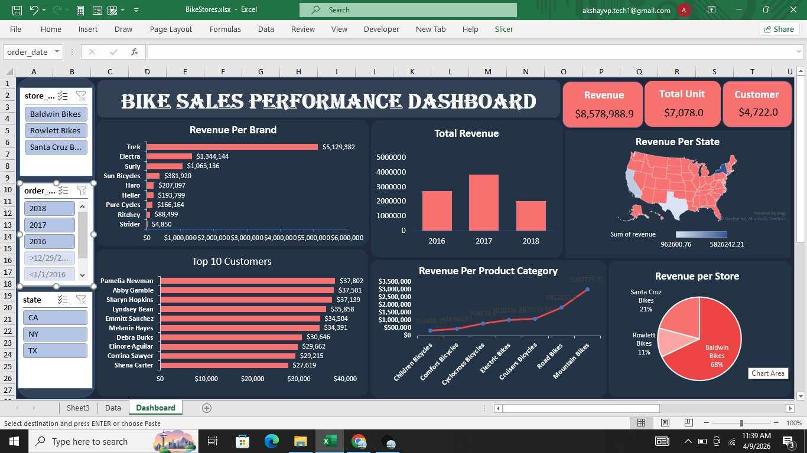

# 🚲 Bike Sales Performance Dashboard


> An interactive Excel dashboard analyzing sales performance across three bike retail stores — covering fiscal years 2016 to 2018.

---

## 📸 Dashboard Preview



---

## 📌 Overview

An interactive Excel dashboard analyzing sales performance across three bike retail stores — **Baldwin Bikes**, **Rowlett Bikes**, and **Santa Cruz Bikes** — covering fiscal years **2016 to 2018**.

Built with PivotTables, slicers, and native Excel charting to deliver executive-level insights with zero external tooling.

> **Core business question:** Which brands, categories, customers, and regions drive the most revenue — and how has performance trended over time?

---

## 📊 Key Metrics

| Metric | Value |
|---|---|
| 💰 Total Revenue | $8,578,988.90 |
| 📦 Units Sold | 7,078 |
| 👤 Unique Customers | 4,722 |
| 🏆 Top Brand | Trek — $5,129,382 |
| 🏪 Top Store | Baldwin Bikes — 68% share |
| 🗺️ Top States | Texas, New York, California |

---

## ✨ Dashboard Features

- **Revenue per Brand** — horizontal bar chart ranking 9 brands by total revenue
- **Total Revenue Trend** — year-over-year column chart (2016, 2017, 2018)
- **Top 10 Customers** — ranked bar chart with individual revenue figures
- **Revenue per Product Category** — line chart across 8 bike categories
- **Revenue per Store** — pie chart with percentage breakdown
- **Revenue per State** — US choropleth map visualization
- **Interactive Slicers** — filter by store name, order date, and state
- **KPI Summary Cards** — revenue, units sold, and customer count at a glance

---

## 💡 Key Insights

### 🏆 Brand Dominance
Trek alone accounts for ~60% of total revenue at **$5.13M** — significantly ahead of second-place Electra at $1.34M.

### 🏪 Store Performance
Baldwin Bikes generates **68% of total revenue**, making it the primary growth driver. Rowlett (11%) and Santa Cruz (21%) represent expansion opportunities.

### 📈 Peak Year
**2017 was the strongest revenue year.** The 2018 decline is worth investigating for seasonal or market-driven causes.

### 🚵 Category Focus
**Mountain Bikes** lead product category revenue — a key priority for stocking and marketing decisions.

---

## 🗂️ File Structure

```
BikeStores.xlsx
├── 📊 Dashboard        ← Main interactive view with charts & slicers
├── 📋 Data             ← Raw transactional sales data
└── 📋 Sheet3           ← PivotTable source data
```

---

## 🛠️ Built With

- Microsoft Excel 365
- PivotTables & PivotCharts
- Slicers (Store, Date, State)
- Power Query (data shaping)
- Bing Maps integration (Excel)
- Conditional Formatting
- Excel native charting engine

---

## 🚀 How to Use

1. **Open** `BikeStores.xlsx` in Excel 365 or Excel 2019+
2. **Navigate** to the `Dashboard` tab
3. **Use the slicers** on the left panel to filter by:
   - `store_name` — Baldwin Bikes, Rowlett Bikes, Santa Cruz Bikes
   - `order_date` — select one or more years (2016, 2017, 2018)
   - `state` — CA, NY, TX
4. All charts and KPI cards **update automatically**

---

## 📁 Setup — Adding the Dashboard Image

To display the preview image in this README:

1. Rename your dashboard screenshot to `dashboard.png`
2. Place it in the **root of this repository** (same folder as `README.md`)
3. GitHub will render it automatically in the preview above

---

## 👤 Author

Built as a business intelligence portfolio project.  
Data sourced from the **BikeStores sample database**.  
Dashboard design and analysis by **[@akshayvp-tech1](https://github.com/akshayvp-tech1)**

---
